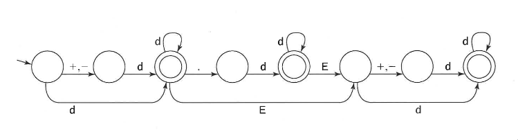

# Finite State Machine
This repository holds a small implementation for FSM's.
It tries to keep evaluation fast by storing the transitions in a 2D table like
this:
|    | I0 | I1 | I2 | ... |
|----|----|----|----|-----|
| S0 | Si | Sj | Sk | ... |
| S1 | Si | Sj | Sk | ... |
| S2 | Si | Sj | Sk | ... |
 - `Si` is `state i`, `Ii` is `input i`

 This approach allows a transition at runtime to be a simple 2D array lookup.
 Fast, but for sparse FSM's this is not the ideal memory layout of course.

## Limitations
### Checking Validity
This implementation is geared towards creating automata
that check the validity of an input, not to have like processes change state
during runtime.

### Alphabet size
This implementation uses `ichar` under the hood, which limits the size of the
alphabet to 128 symbols. Currently I don't have a usecase that needs more
as the whole ASCII range is possible with 128 symbols.


## Examples
To compile each example you'll need a [C3 compiler](https://github.com/c3lang/c3c/)
and compile your example file together with `automaton.c3`.
For the float-checker this looks like this:
```sh
$ c3c compile automaton.c3 examples/check_float.c3
Program linked to executable './check_float'.

$ ./check_float -1e3
Float '-1e3' is valid: true.
```

### Float string checker

This relatively small FSM can check the validity of a floating point number.
You can find the implementation inside
[./examples/check_float.c3](./examples/check_float.c3).

